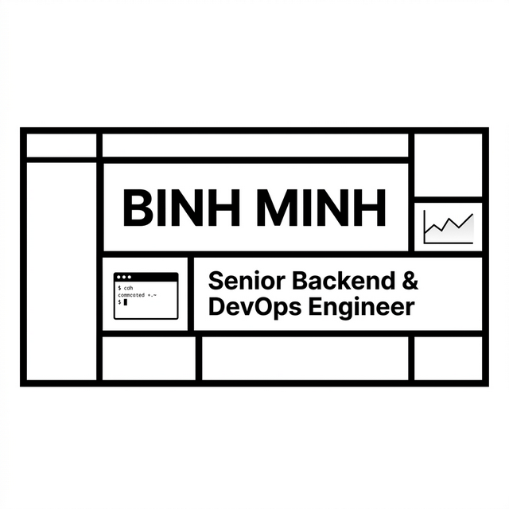

# Binh Minh - Backend & DevOps Engineer Portfolio



A personal portfolio website and web-based Brutalist CV tailored for showcasing Backend and DevOps engineering skills. Built with modern web technologies, this project emphasizes performance, clean code, and a unique Brutalist aesthetic.

## 🚀 Live Demo
- **Portfolio (EN/VI)**: [https://portfolio-binhminh.vercel.app](https://portfolio-binhminh.vercel.app)
- **Web CV (EN)**: [https://portfolio-binhminh.vercel.app/cv](https://portfolio-binhminh.vercel.app/cv)
- **Web CV (VI)**: [https://portfolio-binhminh.vercel.app/cv-vi](https://portfolio-binhminh.vercel.app/cv-vi)

## 🛠️ Tech Stack & Features
- **Framework**: [Next.js](https://nextjs.org) 15 (App Router, React 19)
- **Styling**: [Tailwind CSS](https://tailwindcss.com/)
- **Icons**: Lucide React
- **Language**: TypeScript

### ✨ Key Capabilities
- **Brutalist Design System**: High-contrast, monochromatic aesthetic with bold typography and raw structural elements mimicking early internet design.
- **i18n Localization**: Fully integrated English and Vietnamese context-based translation switcher without external heavy libraries.
- **Printable Single-Page CV**: Custom `@page` CSS optimizations ensuring the `/cv` and `/cv-vi` routes output perfect, 1-page A4 PDFs directly from the browser's native print menu.
- **Interactive Technical Components**: Includes custom implementations of complex UI flows:
  - **GitOps CI/CD Pipeline Flow**: Interactive diagram explaining deployment stages.
  - **Grafana/K8s Visualizations**: Mock dashboard components illustrating complex system observability.
  - **Web Terminal Console**: An interactive terminal component for browsing skills via CLI commands.
- **SEO Ready**: Programmatic OpenGraph images and structured metadata.

## 📥 Local Development

First, ensure you have Node.js installed. Clone the repository and install dependencies:

```bash
# Install dependencies
npm install

# Run the development server
npm run dev
```

Open [http://localhost:3000](http://localhost:3000) with your browser to see the result.

## 🖨️ PDF Generation (CV)
To export the CV, navigate to `/cv` or `/cv-vi` on your local or deployed environment.
Click the **Print / Save as PDF** button or press \`(Ctrl+P / Cmd+P)\`. 
*Note: Make sure to enable "Background graphics" in your print dialog if your browser disables it by default.*

## 📄 License
This project is open-source and available under the MIT License.
