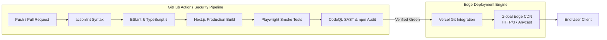

<div align="center">

```text
  ██████╗ ██╗███╗   ██╗██╗  ██╗███╗   ███╗██╗███╗   ██╗██╗  ██╗
  ██╔══██╗██║████╗  ██║██║  ██║████╗ ████║██║████╗  ██║██║  ██║
  ██████╔╝██║██╔██╗ ██║███████║██╔████╔██║██║██╔██╗ ██║███████║
  ██╔══██╗██║██║╚██╗██║██╔══██║██║╚██╔╝██║██║██║╚██╗██║██╔══██║
  ██████╔╝██║██║ ╚████║██║  ██║██║ ╚═╝ ██║██║██║ ╚████║██║  ██║
  ╚═════╝ ╚═╝╚═╝  ╚═══╝╚═╝  ╚═╝╚═╝     ╚═╝╚═╝╚═╝  ╚═══╝╚═╝  ╚═╝
```

### **Systems Engineering Showcase & ThinkAI Studio Portfolio**

*Architected for zero-trust delivery, bare-metal reliability, and 0px editorial precision.*

[](https://binhminh.thinkai.id.vn)
[](https://github.com/bnhminh1010/portfolio/actions/workflows/quality.yml)
[](https://github.com/bnhminh1010/portfolio/actions/workflows/security.yml)
[](https://binhminh.thinkai.id.vn)
[](./.nvmrc)
[](./DESIGN.md)

<p align="center">
  <a href="https://binhminh.thinkai.id.vn">Live Portfolio</a> •
  <a href="https://binhminh.thinkai.id.vn/cv">DevOps CV (PDF)</a> •
  <a href="https://hostdeck.thinkai.id.vn">HomeLab Dashboard</a> •
  <a href="#%EF%B8%8F-architecture--delivery-pipeline">Architecture</a> •
  <a href="#-design-system--visual-taste-tai-ui">Design System</a>
</p>

---

</div>

## ⚡ Overview & Executive Pitch

Welcome to the source repository for **Bình Minh's Developer Portfolio & Systems Engineering Showcase**. 

This platform serves a dual purpose:
1. **DevOps & Infrastructure Showcase:** Demonstrating container orchestration (Rootless Podman, K3s), GitOps delivery paths (Argo CD, GitHub Actions), host hardening (systemd, ZRAM, Tailscale WireGuard mesh), and immutable CI/CD security gates.
2. **ThinkAI Studio Flagship:** Showcasing the design philosophy of **ThinkAI Studio**—an infrastructure-grade aesthetic defined by **0px sharp geometry**, Obsidian depth (`#08080a`), WebGL halftone shaders, and a component distribution registry ([`thinkai-ui`](https://github.com/ThinkAI-Studio/thinkai-ui)).

> **Philosophy:** *“Engineering systems that are easier to ship, operate, observe, and recover.”*

---

## 🌐 Production Endpoints & Case Studies

| Target Endpoint | Classification | Core Stack | Security & Ingress Model |
| :--- | :--- | :--- | :--- |
| [**binhminh.thinkai.id.vn**](https://binhminh.thinkai.id.vn) | Production Portfolio | Next.js 16, React 19, Tailwind v4, Three.js | Vercel Global Edge, Zero Runtime Secrets, Static Caching |
| [**binhminh.thinkai.id.vn/cv**](https://binhminh.thinkai.id.vn/cv) | DevOps Resume (PDF) | PDF.js / Stream Engine | Single-Page Direct Stream, Canonical PDF Source |
| [**hostdeck.thinkai.id.vn**](https://github.com/bnhminh1010/HomeLab-Dashboard) | Private Ops Workbench | Go 1.22, Podman, Tailscale, SQLite, WS | WireGuard Private Mesh, Host-Agent Isolation, WAL SQLite |
| [**learning.thinkai.id.vn**](https://github.com/ThinkAI-team/thinkai-backend) | Education DevSecOps | Spring Boot 3, K3s, Docker, Argo CD, Trivy | 2-Pod K3s GitOps, Multi-Stage OCI Images, SAST Gated |

---

## 🏗️ Architecture & Delivery Pipeline

### 1. Bare-Metal Homelab (HostDeck) Operations Architecture
HostDeck manages a 9-service bare-metal container fleet using rootless Podman over a zero-exposure Tailscale mesh.

```
┌─────────────────────────────────────────────────────────────┐
│               Private Tailscale Mesh (WireGuard)            │
│               [ Encrypted Peer-to-Peer Transit ]            │
└──────────────────────────────┬──────────────────────────────┘
                               │
                               ▼
┌─────────────────────────────────────────────────────────────┐
│                 Bare-Metal Host Environment                 │
│  ┌───────────────────────────────────────────────────────┐  │
│  │ Hardened Host-Agent & Go Operations Server            │  │
│  │ • SQLite WAL Time-Series     • PTY Web Terminal       │  │
│  │ • systemd Watchdog Guard     • ZRAM & OOM Supervisor  │  │
│  └───────────────────────────┬───────────────────────────┘  │
│                              │ Rootless Socket API          │
│                              ▼                              │
│  ┌───────────────────────────────────────────────────────┐  │
│  │ 9x Containerized Services (Podman Engine)             │  │
│  │ [Redis]  [PostgreSQL]  [ThinkAI API]  [Auth Daemon]   │  │
│  └───────────────────────────────────────────────────────┘  │
└─────────────────────────────────────────────────────────────┘
```

### 2. Portfolio Edge Delivery & Zero-Trust CI/CD Pipeline


```mermaid
flowchart LR
    subgraph CI ["GitHub Actions Security Pipeline"]
        A[Push / Pull Request] --> B[actionlint Syntax]
        B --> C[ESLint & TypeScript 5]
        C --> D[Next.js Production Build]
        D --> E[Playwright Smoke Tests]
        E --> F[CodeQL SAST & npm Audit]
    end

    subgraph CD ["Edge Deployment Engine"]
        F -->|Verified Green| G[Vercel Git Integration]
        G --> H[Global Edge CDN\nHTTP/3 • Anycast]
    end

    H --> I[End User Client]
```

---

## 🎨 Design System & Visual Taste: `tai-ui`

Built on the **ThinkAI Studio Design Specification** ([`DESIGN.md`](./DESIGN.md)):

* **0px Architectural Geometry:** 100% zero border-radius (`border-radius: 0px !important`) across all cards, dialogs, pills, and inputs.
* **Obsidian Monochromatic Depth:** Deep hắc thạch canvases (`#08080a`, `#0d0d10`, `#131316`) paired with linear-grade 1px top-inset highlights (`shadow-[inset_0_1px_0_0_rgba(255,255,255,0.08)]`) and dynamic alpha borders (`border-white/[0.07]`).
* **WebGL Ocean Halftone Shader:** Custom Three.js procedural shader with smooth camera interpolation and automatic resource shutdown on background tabs.
* **WCAG AAA Reduced-Motion Engine:** Full 4-tier motion accessibility (`Bail`, `Snap-to-End`, `Collapse`, `Reduce`) guaranteeing zero vestibular triggers.
* **Component Registry (`thinkai-ui`):** Modern registry-first UI distribution model ([`registry/registry.json`](./registry/registry.json)), installable directly into external projects via `npx thinkai-ui`.

---

## 🛠️ Technology Matrix

```
HURDLE: INFRASTRUCTURE & BACKEND        CRAFT: INTERFACE & EXPERIENCE
├── Go (Golang) / Spring Boot (Java 21) ├── Next.js 16 (App Router / Turbopack)
├── Rootless Podman & Docker Engine      ├── React 19 + React Compiler
├── Kubernetes (K3s) & Argo CD GitOps    ├── Tailwind CSS v4 + CVA Engine
├── Tailscale WireGuard Mesh Networking  ├── Three.js WebGL Shaders & Lenis 120Hz
└── SQLite (WAL) / PostgreSQL / Redis    └── Motion (Hardware-accelerated)
```

---

## 🚀 Local Engineering Setup

### Prerequisites
* **Node.js:** `>= 24.0.0 < 25.0.0` (Use [`.nvmrc`](./.nvmrc))
* **Package Manager:** `npm` (Lockfile frozen)

### Quick Start
```bash
# 1. Clone repository
git clone https://github.com/bnhminh1010/portfolio.git
cd portfolio

# 2. Match Node version
nvm use

# 3. Clean install exact lockfile dependencies
npm ci

# 4. Start local development server (Turbopack enabled)
npm run dev
```
Open [http://localhost:3000](http://localhost:3000) to view the live workspace.

### Quality & Verification Commands
```bash
# Run strict TypeScript compilation check
npm run typecheck

# Execute Next.js production build
npm run build

# Run Playwright E2E browser smoke suite
npm run test:smoke

# Build and sync the thinkai-ui registry
npm run registry:build
```

---

## 🛡️ Security & Engineering Controls

- **Trust Boundary Policy:** The public site contains zero operational secrets, database connectors, or live infrastructure credentials. All architecture diagrams are strictly demonstrative.
- **Vulnerability Disclosure:** Please review [`SECURITY.md`](./SECURITY.md) before submitting reports. Direct emails to `contact@binhminh.thinkai.id.vn`.
- **Runbooks & Operational Architecture:** Detailed in [`docs/architecture.md`](./docs/architecture.md) and [`docs/runbooks/`](./docs/runbooks/).

---

## 📄 License & Attribution

- **Source Code:** Released under the [MIT License](./LICENSE).
- **Design Language:** Copyright © 2026 **ThinkAI Studio / Nguyen Huu Binh Minh**. Inspired by high-craft editorial design systems (Linear, Vercel).
